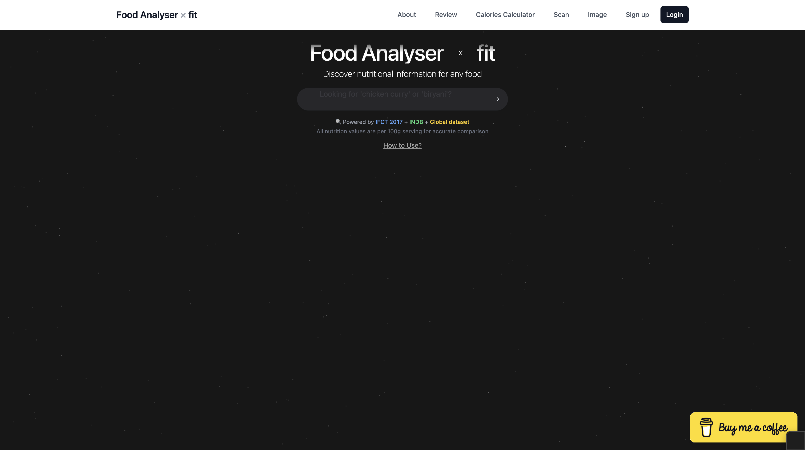
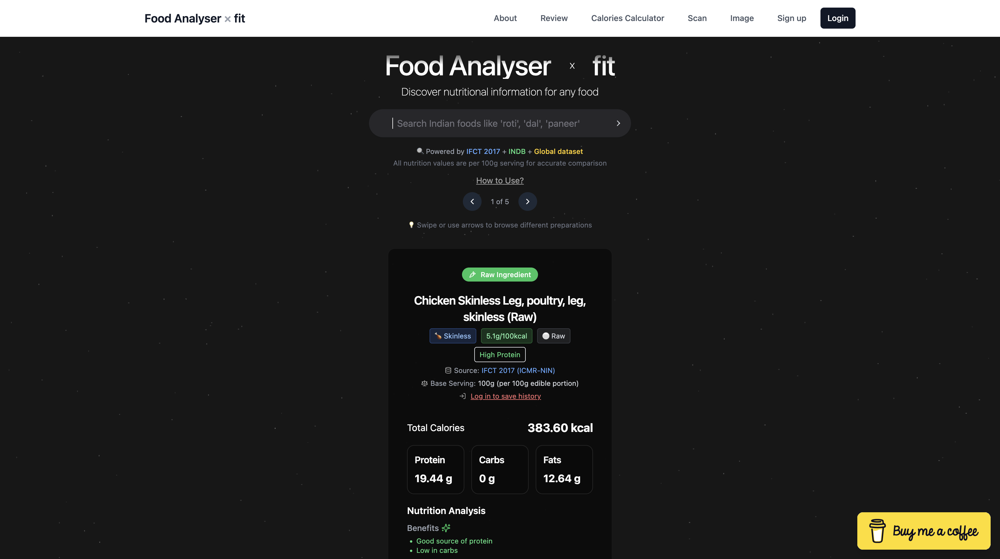
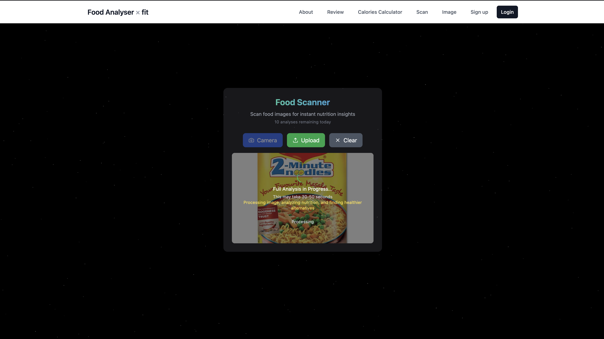
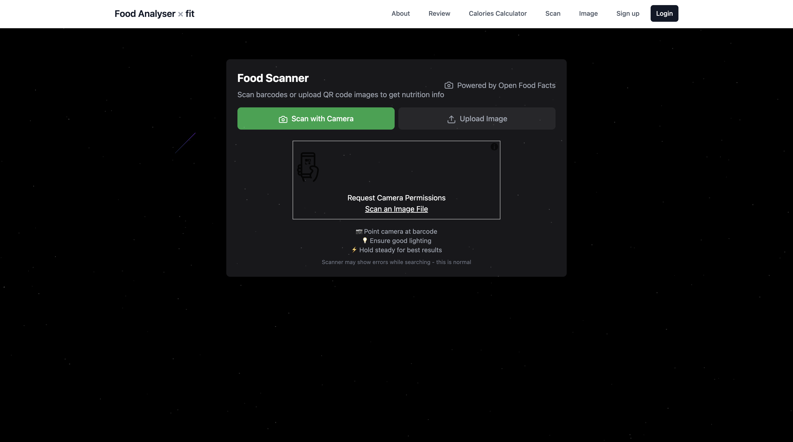
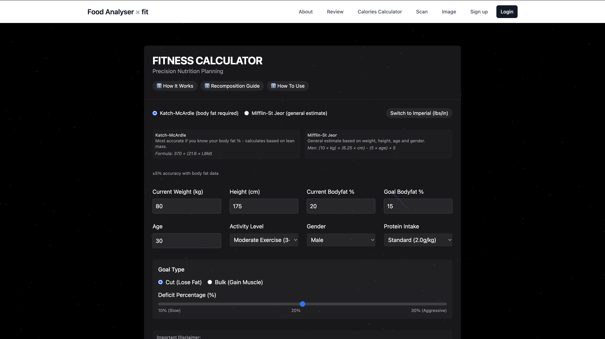
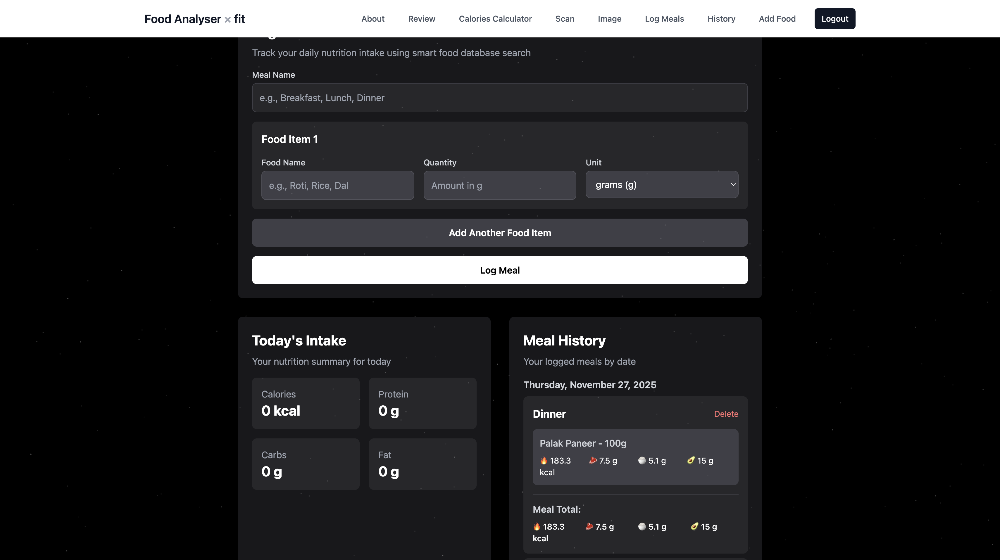
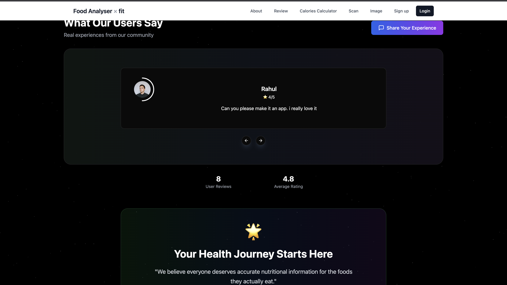

# FoodAnalyser × Fit


## Indian Food Nutrition Intelligence & Health Scoring System

**FoodAnalyser × Fit** is a full-stack nutrition intelligence platform built specifically for Indian dietary patterns. It combines official Indian nutrition datasets (**IFCT 2017** & **INDB**) with AI food image recognition, barcode analysis, meal tracking, and personalized health scoring.

Unlike generic calorie apps that rely mainly on Western food databases, FoodAnalyser prioritizes authentic Indian nutrition data first, then falls back to global sources only when needed.

**Designed for:** Indian consumers, fitness enthusiasts, dieticians, health-tech builders, and nutrition research.

| Live App | API |
|----------|-----|
| [https://foodanalyserr.vercel.app](https://foodanalyserr.vercel.app) | [https://foodanalyser.onrender.com](https://foodanalyser.onrender.com) |

---

## Table of Contents

- [Overview](#overview)
- [Why FoodAnalyser Is Different](#why-foodanalyser-is-different)
- [Data Sources](#data-sources)
- [Features](#features)
- [App Pages & Routes](#app-pages--routes)
- [System Architecture](#system-architecture)
- [API Overview](#api-overview)
- [Tech Stack](#tech-stack)
- [Screenshots](#screenshots)
- [Local Setup](#local-setup)
- [Environment Variables](#environment-variables)
- [Accuracy Notes](#accuracy-notes)
- [Research & Publication](#research--publication)
- [Roadmap](#roadmap)
- [Author](#author)

---

## Overview

FoodAnalyser helps users understand what they eat in an Indian context:

1. **Search** Indian foods and get macros from IFCT / INDB
2. **Scan** packaged products via barcode and map them to Indian equivalents
3. **Photograph** a dish and get AI-assisted identification + nutrition estimates
4. **Calculate** BMR, TDEE, and calorie/protein goals
5. **Log meals** and review daily nutrition history
6. **Leave reviews** with real-time updates across clients

The product is deployed (Vercel frontend + Render backend), JWT-secured for personal data, and research-backed (IEEE CCPIS 2025).

---

## Why FoodAnalyser Is Different

1. Built on **IFCT 2017 (ICMR–NIN)** — India’s official food composition table
2. Uses **INDB (Indian Nutrient Databank)** for cooked & traditional recipes
3. **AI-powered** food image recognition (OpenAI Vision)
4. **Barcode scanning** with Open Food Facts + Indian food mapping
5. Nutrition-aware **health scoring** and healthier alternative suggestions
6. Secure **meal logging**, search history, and analytics
7. Real-time **reviews** via Socket.io
8. Deployed, scalable, and research-ready

---

## Data Sources

### IFCT 2017 (ICMR–NIN)
- 500+ Indian food items (project loads ~542)
- Macro & micronutrients (energy, protein, carbs, fat, fibre, and more)
- Standardized per-100g values
- Government / research-verified composition data

### INDB (Indian Nutrient Databank)
- Cooked foods & traditional Indian recipes (~1000+)
- Serving-oriented nutrition for everyday Indian meals
- Beverage & regional preparation coverage

### External (Fallback / Packaged Foods)
| Source | Used for |
|--------|----------|
| **Open Food Facts** | Packaged products by barcode |
| **CalorieNinjas** | Nutrition fallback when Indian DBs have no match |
| **OpenAI Vision** | Food name identification from images |

---

## Features

### 1. Indian-Optimized Food Search
- Home-page search with vanishing-input UI and starfield background
- Ranked matching across IFCT → INDB → CalorieNinjas (fallback only)
- Intelligent grouping / diversification (raw, cooked, fried, curry, beverage, etc.)
- Chicken cut & preparation specificity (breast, thigh, curry, fried, etc.)
- Result carousel with macros, source badges, and gram-based scaling from the query
- Heuristic pros / cons style insights for each match
- Authenticated search history logging in MongoDB

### 2. AI Food Image Recognition (`/image`)
- Camera capture or image upload
- Image optimization (Sharp) before analysis
- OpenAI Vision (`gpt-4-turbo`) identifies the main food item (Indian names preferred)
- Nutrition resolved against IFCT when possible
- Heuristic glycemic index (GI) estimate
- Health score (0–100) from calories, macros, and GI
- Healthier Indian alternative suggestions
- Quick-score mode for faster health scoring
- In-memory analysis cache (TTL) + client-side daily upload limit

### 3. Barcode / QR Scanning (`/scan`)
- Live camera scanning (`html5-qrcode`) or image upload
- Server-side decode via Sharp preprocessing + ZXing
- Product lookup from Open Food Facts
- Nutrition normalization and display
- Indian food equivalent mapping (IFCT / INDB)
- Health score computation (Nutri-Score when available, else nutrient heuristic)
- Healthier Indian alternatives for packaged products

### 4. Health & Diet Calculator (`/calculator`)
- BMR via Mifflin–St Jeor / Katch–McArdle style calculations
- TDEE from activity multipliers
- Cut / bulk / recomp calorie targets
- Protein intake estimation
- Multi-week planning table for goal tracking
- Works fully on the client (no login required)

### 5. Meal Logging & Daily Tracking (`/logmeals`)
- JWT-protected meal logging
- Multi-item meals with quantity / unit
- Nutrition lookup via CalorieNinjas + Indian food search fallback
- Per-meal macro aggregation (calories, protein, carbs, fat)
- Daily totals overview
- Meal history with date / type / calorie filters
- Delete individual logged meals

### 6. Search History (`/history`)
- View recent authenticated food searches
- Delete single items, bulk delete, or clear all history
- Soft-gated behind login

### 7. Custom Foods (`/addfoods`)
- Authenticated users can add / edit / manage personal food entries
- Store name, macros, pros, and cons for reuse in tracking workflows

### 8. Authentication & Security
- Email / password signup & login
- JWT authentication middleware for protected APIs
- Google & GitHub OAuth (popup + `postMessage` token handoff)
- Auth context on the frontend (`localStorage` token)
- Soft route protection for Log Meals, History, and Add Food

### 9. Reviews & Feedback (`/review`, `/about`)
- Guest or authenticated review submission (name, rating, description)
- Paginated reviews list and rating distribution stats
- Real-time create / delete updates via Socket.io
- About page with product story, feature highlights, and live review testimonials
- Testimonial carousel UI

### 10. Product Experience / UX
- Responsive layout (desktop + mobile nav)
- Framer Motion / Aceternity-style motion components (stars, vanish input, cards)
- Loading skeletons for search results
- Toast notifications (Sonner-based UI)
- Dark atmospheric home experience with shooting-stars background
- Fixed global navbar: About, Review, Calculator, Scan, Image + auth actions

---

## App Pages & Routes

| Route | Page | Access | Purpose |
|-------|------|--------|---------|
| `/` | Home + Food Search | Public | Brand landing, Indian food search, results carousel |
| `/about` | About | Public | Mission, features, testimonials, review stats |
| `/review` | Reviews | Public | Submit and browse user feedback |
| `/calculator` | Health Calculator | Public | BMR / TDEE / goal planning |
| `/scan` | Barcode Scanner | Public | Scan packaged foods |
| `/image` | Image Recognition | Public | Photo → food ID + nutrition |
| `/login` | Login | Public | Email / password auth |
| `/signup` | Signup | Public | Account creation + OAuth |
| `/logmeals` | Log Meals | Auth | Log meals & daily macros |
| `/history` | Search History | Auth | Manage past searches |
| `/addfoods` | Add Food | Auth | Personal food library |

---

## System Architecture

```
Frontend (React + Vite + Tailwind)          Backend (Node.js + Express)
─────────────────────────────────          ────────────────────────────
AuthContext (JWT / OAuth)          ──►     /api/auth
ReviewsContext + Socket.io         ──►     /api/reviews + Socket.io
Food Search UI                     ──►     /api/food/search (IFCT → INDB → CalorieNinjas)
Barcode Scanner                    ──►     /api/scan (ZXing + Open Food Facts)
Image Recognition UI               ──►     /api/image (OpenAI Vision + IFCT)
Meal Logging & History             ──►     /api/meal + /api/food/history
Calculator (client-side)                   /api/calories (optional server calculator)
                                           MongoDB (users, meals, searches, reviews)
                                           Local JSON: IFCT + INDB datasets
```

**Deployment**
- Frontend → **Vercel**
- Backend → **Render**
- Database → **MongoDB Atlas**

---

## API Overview

| Mount | Capabilities |
|-------|----------------|
| `GET /health` | Service + MongoDB readiness |
| `/api/auth` | Signup, login, Google/GitHub OAuth |
| `/api/food` | Indian search, product-by-barcode, health-score, search history CRUD |
| `/api/meal` | Nutrition proxy, meal log create / list / delete |
| `/api/calories` | Server-side BMR / TDEE calculator |
| `/api/scan` | Image barcode upload/decode, product fetch, health score |
| `/api/image` | `analyzefood`, `quick-score`, cache info |

---

## Tech Stack

### Frontend
- React 19 (JSX) + Vite 6
- React Router 7
- Tailwind CSS + Radix / shadcn-style UI
- Context API (`AuthContext`, `ReviewsContext`)
- Axios / Fetch
- Framer Motion, Lucide / Tabler icons
- `html5-qrcode` for camera barcode scanning
- Three.js / React Three Fiber (optional visual components)

### Backend
- Node.js + Express
- MongoDB + Mongoose
- JWT + Passport (Google, GitHub OAuth)
- OpenAI Vision API
- Sharp (image processing)
- ZXing (barcode decoding)
- Socket.io (real-time reviews)
- Multer (uploads)
- Morgan, CORS, dotenv

### Data & Persistence Models
- `User` — accounts + OAuth identities
- `MealLog` — logged meals & macros
- `FoodSearch` — authenticated search history
- `Review` — ratings & feedback
- `Food` — user / app food documents
- Local JSON datasets — IFCT & INDB

---

## Screenshots

### Home & Food Search


### Indian Food Nutrition Search


### AI Food Image Recognition


### Barcode Scanning & Product Analysis


### Health & Diet Calculator


### Meal Logging & Nutrition History


### Reviews & Feedback


---

## Local Setup

### Prerequisites
- Node.js 18+ (recommended)
- MongoDB connection string (Atlas or local)
- API keys for features you want to use (OpenAI, CalorieNinjas, OAuth)

### 1. Clone
```bash
git clone https://github.com/suvamneog/foodAnalyser-v2.git
cd foodAnalyser-v2
```

### 2. Environment
Create a `.env` in the repo root (or copy it to `server/.env`). The backend loads env vars via `dotenv` from the server working directory.

```bash
cp .env server/.env   # if your secrets live at the repo root
```

Suggested local port (matches frontend `apiConfig` in development):

```bash
echo 'PORT=3001' >> server/.env
```

### 3. Backend
```bash
cd server
npm install
node server.js
# or: npm run dev  (nodemon)
```

Server default: `http://localhost:3001` (if `PORT=3001`)

### 4. Frontend
```bash
cd client
npm install
npm run dev
```

App: `http://localhost:5173` (Vite default)

### Quick health check
```bash
curl http://localhost:3001/health
```

---

## Environment Variables

| Variable | Required for | Description |
|----------|--------------|-------------|
| `MONGODB_URL` | Core | MongoDB connection string |
| `JWT_SECRET` | Auth | JWT signing secret |
| `PORT` | Core | Backend port (use `3001` for local client defaults) |
| `CALORIE_NINJA_API_KEY` | Search fallback / meal nutrition | CalorieNinjas API |
| `OPENAI_API_KEY` | Image recognition | OpenAI Vision |
| `GOOGLE_CLIENT_ID` / `GOOGLE_CLIENT_SECRET` | OAuth | Google login |
| `GITHUB_CLIENT_ID` / `GITHUB_CLIENT_SECRET` | OAuth | GitHub login |
| `CLIENT_URL` | Optional | Frontend origin (logged / reference) |
| `UPLOAD_DIR` | Optional | Upload directory name |

> Never commit real `.env` files. Keep secrets out of git.

---

## Accuracy Notes

| Capability | Trust level | Notes |
|------------|-------------|--------|
| IFCT / INDB text search | High (reference data) | Official tables; values are typically per 100g / dataset serving |
| Barcode / Open Food Facts | Medium | Depends on product listing completeness |
| Image → food name | Medium | Vision model identification; wrong name → wrong nutrition |
| Health score / GI | Directional | Heuristic formulas, not clinical lab measures |
| CalorieNinjas fallback | Medium | Useful when Indian DBs miss; may be Western-biased |
| BMR / TDEE calculator | Estimate | Standard equations, not metabolic testing |

Use FoodAnalyser as an **Indian nutrition intelligence assistant**, not medical advice.

---

## Research & Publication

This system has been extended into academic research and accepted at:

**IEEE CCPIS 2025**  
*"Intelligent Indian Food Nutrition Analysis Using AI & Official Nutrition Databases"*

---

## Roadmap

- Portion size estimation from images
- Personalized AI diet planning
- Multilingual Indian food recognition
- Mobile app (React Native)
- Dietician & hospital dashboards
- Stronger confidence reporting (replace hardcoded image confidence)
- Measured GI datasets where available

---

## Project Structure

```
foodAnalyser-v2/
├── client/                 # React + Vite frontend
│   ├── src/pages/          # Home, scan, image, meals, auth, reviews, …
│   ├── src/components/ui/  # Shared UI primitives & motion components
│   └── src/utils/          # Auth, reviews, API config, fetch helpers
├── server/                 # Express API
│   ├── routes/             # auth, food, meal, scan, image, reviews, calculator
│   ├── models/             # Mongoose schemas
│   ├── middleware/         # JWT auth
│   └── data/               # IFCT & INDB JSON datasets
├── screenshots/            # Product screenshots
└── README.md
```

---

## Author

**Suvam Neog**  
B.Tech CSE · Full-Stack & AI Systems Developer  
Research contributor (IEEE CCPIS 2025)

© 2026 Suvam Neog. All rights reserved.  
Shared for educational and portfolio purposes.
